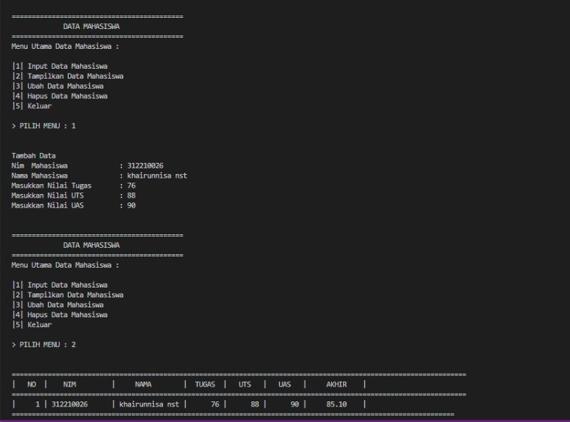
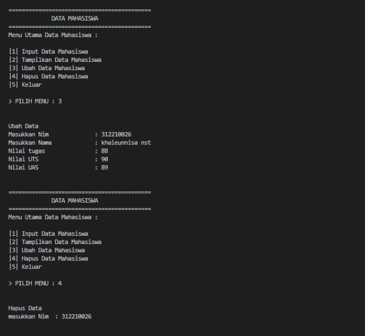
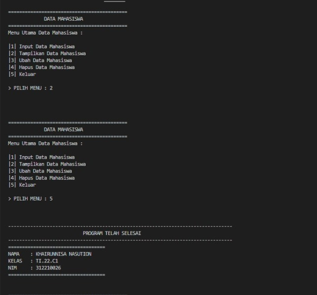
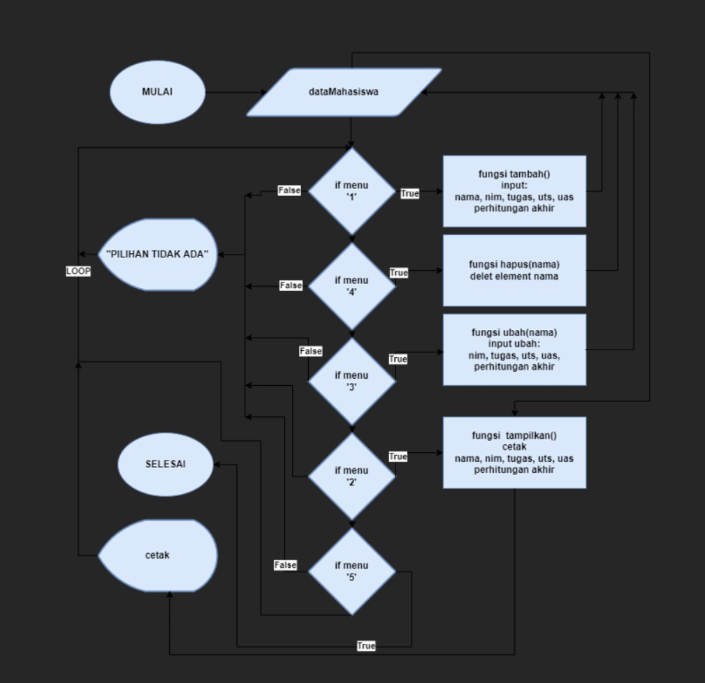

#praktikumm8
# pertemuan 12 

```s
NAMA    : KHAIRUNNISA NASUTION
NIM     : 312210026
KELAS   : TI.22.C1
MATKUL  : BAHASA PEMROGRAMAN
```

# PRAKTIKUM
## Membuat Program Sederhana Dengan Mengaplikasikan Penggunaan Class

## Code Source

```
data = {}
class Data():
     def __init__(self,nim,nama,tugas,uts,uas,akhir):
        while True:

            print("\n")
            print('='*43)
            print('             DATA MAHASISWA              ')
            print('='*43)
            print('Menu Utama Data Mahasiswa : \n')
            print('|1| Input Data Mahasiswa        ')
            print('|2| Tampilkan Data Mahasiswa    ')
            print('|3| Ubah Data Mahasiswa         ')
            print('|4| Hapus Data Mahasiswa        ')
            print('|5| Keluar                      \n')

            x = input("> PILIH MENU : ")

            print("\n")

            if x == '1':
                self.TAMBAH()
            elif x == '2':
                self.TAMPILKAN()
            elif x == '3':
                self.UBAH()
            elif x == '4':
                self.HAPUS()
            elif x == '5':
                self.KELUAR()
            
            else:
                exit()

     def TAMBAH(self):
        print("Tambah Data")
        self.nim    = input('Nim  Mahasiswa\t           : ')
        self.nama   = input('Nama Mahasiswa\t           : ')
        self.tugas  = int(input('Masukkan Nilai Tugas\t   : '))
        self.uts    = int(input('Masukkan Nilai UTS\t   : '))
        self.uas    = int(input('Masukkan Nilai UAS\t   : '))
        self.akhir = (self.tugas * 30/100) + (self.uts * 35/100) + (self.uas * 35/100)
        data[self.nim] = self.nama, self.tugas, self.uts, self.uas, self.akhir

class mahasiswa(Data):

    def TAMPILKAN(self):
        if data.items():
            print('==================================================================================================================')
            print('|   NO  |    NIM         |     NAMA        |  TUGAS  |   UTS   |   UAS   |     AKHIR    |')
            print('==================================================================================================================')
            i = 0
            for a in data.items():
                i += 1
                print("|    {no:2d} | {0:14s} | {1:11s} | {2:7d} | {3:7d} | {4:7d} |    {5:6.2f}    |".format (a[0][: 14],a[1][0],a[1][1],a[1][2],a[1][3],a[1][4], no = i))
                print('===============================================================================================================')
    
    def UBAH(self):
        print("Ubah Data")
        self.nim = input("Masukkan Nim              : ")
        if self.nim in data.keys():
            self.nama = input("Masukkan Nama\t          : ")
            self.tugas = int(input("Nilai tugas\t          : "))
            self.uts = int(input("Nilai UTS\t          : "))
            self.uas = int(input("Nilai UAS\t          : "))
            self.akhir = (self.tugas * 30/100) + (self.uts * 35/100) + (self.uas * 35/100)
            data[self.nim] = self.nama, self.tugas, self.uts, self.uas, self.akhir
        else:
            print("MAAF, DATA TIDAK DITEMUKAN")

    def HAPUS(self):
        print("Hapus Data")
        self.nim = input("masukkan Nim  : ")

        if self.nim in data.keys():
            del data[self.nim]
        else:
            print("MAAF, DATA TIDAK DITEMUKAN")

    def KELUAR(self):
        print()
        print("---------------------------------------------------------------------------------")
        print("                           PROGRAM TELAH SELESAI                    ")
        print("---------------------------------------------------------------------------------")
        print(35*'=')
        print("NAMA\t: KHAIRUNNISA NASUTION\nKELAS\t: TI.22.C1\nNIM\t: 312210026")
        print(35*'=')

datamhs = mahasiswa("nama", "nim", "uts", "uas", "tugas", "akhir")
```

## Output







## Flowchart


## Penjelasan
1. Deklarasi dictionary dengan nama _dataMahasiswa_ untuk menampung semua data/element.
2. gunakan fungsi _def tambah()_ di isi dengan inputan nama, nim, tugas, uts, uas dan perhitungan nilai akhir untuk dan di masukan ke dictonary _dataMahasiswa_.
3. gunakan fungsi _def tampilkan()_ di isi dengan cetak isi dari dictonary.
4. gunakan fungsi _def hapus(nama)_ di isi dengan syntax delet untuk menghapus element _nama_ pada dictonary _dataMahasiswa_.
5. gunakan fungsi _def ubah(nama)_ di isi dengan inputan _nama_ dan mengubah isi element pada _nama_ tersebut.
6. gunakan _while True_ untuk menlooping/mengulang statment.
7. gunakan statment _if, elif, else,_ di dalam _while True_ dan panggil fungsi dari masing masing fungsi, contoh:
```sh
tambah()
tampilkan()
hapus(nama)
ubah(nama)
```
8. SELESAI

